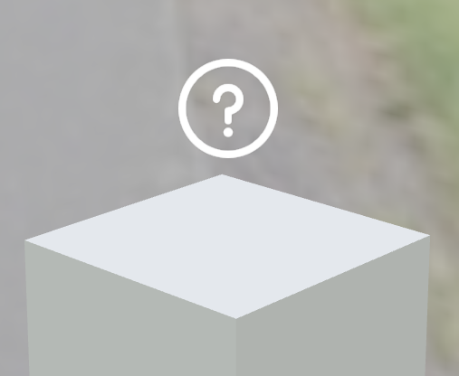
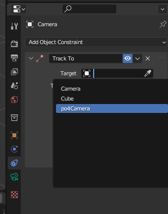
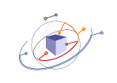

Guide for artists
=================

Smb display 2 is a gltf model viewer.

The viewer has additional features for specially crafted gltf files.

Cameras and points of interest
------------------------------

A viewport camera is automatically in the scene.
It is controlled by the user.
It orbits around a center while keeping it's head upright.
It will never roll.

The user can choose to see through any camera you place in the scene.
When that happens the viewport camera transitions to the chosen camera.

A point of interest is an empty 3d object that has a camera associated to it.

The viewer will replace your empty with a sprite that the user can click.
On click the view will transition to the camera associated with the empty.

Example
-------

A minimal :download:`model ` example. It has one point of interest.

Workflow
--------

Image examples from blender.

1. you place an empty above a mesh

  .. image:: img/add-empty.png

2. you aim a camera at the empty

  .. image:: img/add-cam.png

3. you give the camera a name  "LookingAtPotato"
4. you name the empty "poi4LookingAtPotato"

  .. image:: img/name-empty.png

5. you export as glTF 2.0  glb.
   Take care to select camera and lights for export. Also set lighting mode to unitless.

  .. image:: img/export.png

Effects:

* empty will be displayed as a floating eye sprite (billboard)
* when clicked "LookingAtPotato" will become the active camera.
* the viewport camera orbits the empty now (like blender numpad .)

Limitations:

* if your camera does not look at the empty directly (gives it the side eye)
   then the viewport camera will jump to look at the empty.
* if your camera is tilted ear to shoulder then again the viewport will jump to 
   stand upright once the user drags the mouse.
* if your cameras attempt a zoom effect by having different field of views's then again jumpscares 

You can make the camera look at the empty with a constraint in blender:

Camera motion
-------------

When the user clicks a sprite the view camera will start a motion towards the camera
associated with that sprite.

If a direct path from the current camera to the destination is short and outside the
bounding sphere of the scene then the motion is a direct one.
See grey path below. 

If however, the bounding sphere is intersected, then the motion will travel to the 
sphere along a radius, then travel on the surface of the sphere until above the
destination camera and finally travel to the destination along a radius.
See red and orange paths below.

During the travel on the sphere the camera will look at the center of the sphere.

If the bounding sphere is not intersected but the motion is a large one then
we travel on a large sphere. This is similar to the above case.
But instead of the bounding sphere we travel on a larger one.
See the blue path below.

Material variants
-----------------

Versions of materials for objects in your scene. You can define different choices of
materials. The user can switch between them. 

You can read a guide on how to author these material variants in blender 
`here <https://docs.blender.org/manual/en/latest/addons/import_export/scene_gltf2.html#gltf-variants>`_

Lighting
--------

We support punctual lights: point lights, spot lights and directional ones.

We support and encourage hdri environment maps. However you may not choose a hdri per model.
We have a fixed selection of hdri's available.

Animation
---------

You can animate object position and rotation. The animated objects can be meshes and lights.
Animated cameras are not supported.

We do support armature bones animations. However mesh morphing is not tested.
Limit yourself to position and rotation.

Cameras and points of interest will not follow moving objects.

Units of measure
----------------

A vertex at 1, 0, 0 is considered 1 meter away on the x axis.

The up vector is +y.
Angles are in radians.

A light intensity of 1 is saturated white.

The textures are in sRGB color space.

Limitations
-----------

We assume that:

* Global topology is approximated by a sphere.
  If broken cameras may clip into models or flip 180 degrees.
* Target cameras are not inside concavities.
  If broken cameras may clip into models
* Model animations do not significantly alter the global bounding box.
  If broken: the camera won’t follow the model. It will still look and rotate around the ghost of the former model.
* Cameras all have the same field of view
  If broken: camera will jump
* Cameras look at their point of views
  If broken: camera will jump

Feature list
------------

Standard features:

  - model loading
  - point lights
  - PBR materials
  - HDRI environments
  - shadows
  - key framed animations 
  - armature animations

Additional features:

  - material variants
  - points of interest

