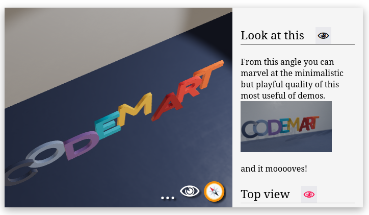
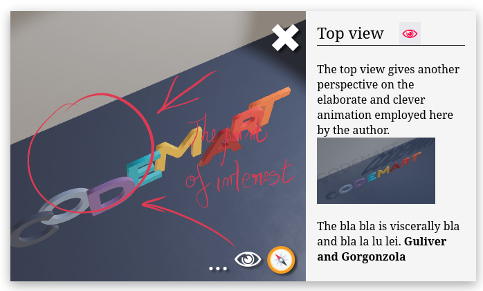

Guide for story writers
=======================

For each point of interest that has been defined by the artist in the gltf file
you can create a html description.

You do so by providing a specially formatted json file.

These descriptions will be shown near the 3d viewport. And they are synchronized with the 3d view.

Besides writing a description for a point of interest you may optionally choose: 

* the icon in the 3d for the point of interest
* a sound to play for the point of interest
* which animations to play 
* a skin for the 3d objects

Generate descriptions json from glb
-----------------------------------

If you have the viewer installed, there is a tool that makes a template json file for a 
given gltf one.

To install the viewer you need nodejs and a package of the viewer:

.. code:: bash

  $ cd folder_to_install_to
  $ npm install smb-display-2.tgz

Now if the artist gave you a file model.glb that contains points of interest you 
want to describe run this to get started:

.. code:: bash

  $ npx glb2json assets/model.glb

It will create a file 'minimal.glb.json'. Then you can edit it to fill in the content.

.. code:: json

  {
    "title": "Story title",
    "content": [
      {
        "title": "Title for camera LookingAtPotato",
        "html": "
 some fancy description html 
",
        "camera": "LookingAtPotato",
        "materialVariant": "pick a material variant or delete this line. Available variants: ",
        "animations": [],
        "overlayHtml": "
 some html to be shown on top of the 3d scene. Or delete this line 
",
        "sprite": "url to a sprite texture or delete this line"
      }
    ],
    "gltfUrl": "minimal.glb",
    "chapters": [
      {
        "id": "chapter",
        "title": "chap",
        "cameras": [
          "LookingAtPotato"
        ]
      }
    ]
  }

Example
-------

A minimal example. For the :download:`model ` the corresponding :download:`story json `.

Associated glb file
-------------------

You must provide a url to the associated 3d model file:

.. code:: json

  "gltfUrl": "minimal.glb",

Sections
--------

Content is a list of sections, each corresponding to a camera name defined in the glb file.
The camera property behaves like a key, so it is unique. And it must exist in the glb file with the exact same name.

You can edit the titles and the html strings.

Description overlays
--------------------

If a section in the json contains the key "overlayHtml" then when the
associated camera is active that html will be rendered on top of the 3d view

For example this section:

.. code:: json

  {
    "title": "Top view",
    "camera": "Camera_top",
    "html": "
 description 
",
    "overlayHtml": ""
  }

will produce this 

Controlling viewer state from stories
-------------------------------------

The following keys if present will change the 3d view

Image to use for the view point. Optional. Must be a url relative to baseurl.

.. code:: json

   "sprite": "lala.png"

List of animations to be active when view point is focused:

.. code:: json

   "animations": ["anim2", "anim3"]

Model skin (material variant) to be active when view point is focused:

.. code:: json

    "materialVariant": "uv"

Audio file to play for the view point. Optional.

.. code:: json

    "audio": "narration.mp3"

Chapters
--------

A chapter is a group of sections. Each section is uniquely idendified by the camera name.

Chapters are defined in the chapters list. A chapter has a list of cameras and a id.
The chapter id must be any unique string.

.. code:: json

  "chapters": [
    { "id": "chapter", "title": "chap", "cameras": [ "LookingAtPotato" ] }
  ]

